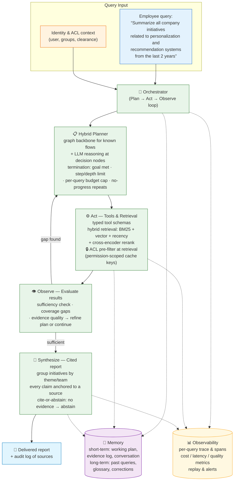

# Enterprise Knowledge Research Agent

**Interview Kickstart — Applied Agentic AI, Week 1 assignment**
*Agentic Research Systems: Planning, Tools & Guardrails*

## Assignment overview

Design an enterprise-grade research agent that can answer deep, open-ended research questions over a large corporate knowledge base — safely, accurately, and with full provenance. The design is driven by one running example query throughout:

> **"Summarize all company initiatives related to personalization and recommendation systems from the last 2 years."**

This is a hard query: it is broad, spans many documents, needs freshness ("last 2 years"), touches permission-sensitive internal content, and demands a synthesized, cited report rather than a list of links. The system below is designed to answer it — and queries like it — with a Plan → Act → Observe loop, permission-aware hybrid retrieval, grounded synthesis with cite-or-abstain, and production-grade guardrails.

## Deliverables

| # | Deliverable | File |
|---|-------------|------|
| 1 | Architecture diagram | This README (Mermaid flowchart below) |
| 2 | Written system design document | [docs/01-system-design.md](docs/01-system-design.md) |
| 3 | Trade-off analysis | [docs/02-trade-offs.md](docs/02-trade-offs.md) |
| 4 | Failure mode analysis | [docs/03-failure-modes.md](docs/03-failure-modes.md) |
| 5 | Production operations discussion | [docs/04-production-operations.md](docs/04-production-operations.md) |

## Architecture

**How the example query flows through the system:** the employee's query and identity context enter the Orchestrator, which plans a research strategy (decompose into sub-queries like "personalization initiatives 2024–2026", "recommendation systems projects", "relevant teams and launches"). Each Act step retrieves documents through ACL-pre-filtered hybrid search; Observe checks whether the evidence covers the two-year window and the themes adequately, looping back to refine the plan when gaps remain. Synthesis then produces a grouped, cited report — and any claim that cannot be anchored to retrieved evidence is dropped rather than hallucinated.

## Design principles

1. **Security is structural, not a filter.** Permissions are enforced at retrieval time (ACL pre-filter), never as a post-processing pass.
2. **Every claim is earned.** The synthesis engine cites sources or abstains — there is no uncited text in a delivered report.
3. **Bounded autonomy.** The agent plans and acts freely *within* a termination envelope: step/depth limits, a per-query cost budget, and no-progress detection.
4. **External content is data, never instructions.** Retrieved documents are treated as untrusted data; prompt-injection defenses are built into every stage.
5. **Observable by default.** Every query produces a trace, cost accounting, and replayable spans — the system is debuggable in production, not just in demos.

---

*Author: Sai Kumar Palem — Interview Kickstart Applied Agentic AI (Mid-June cohort)*
