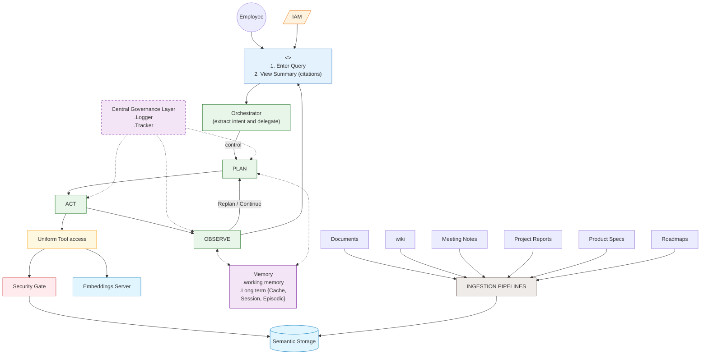
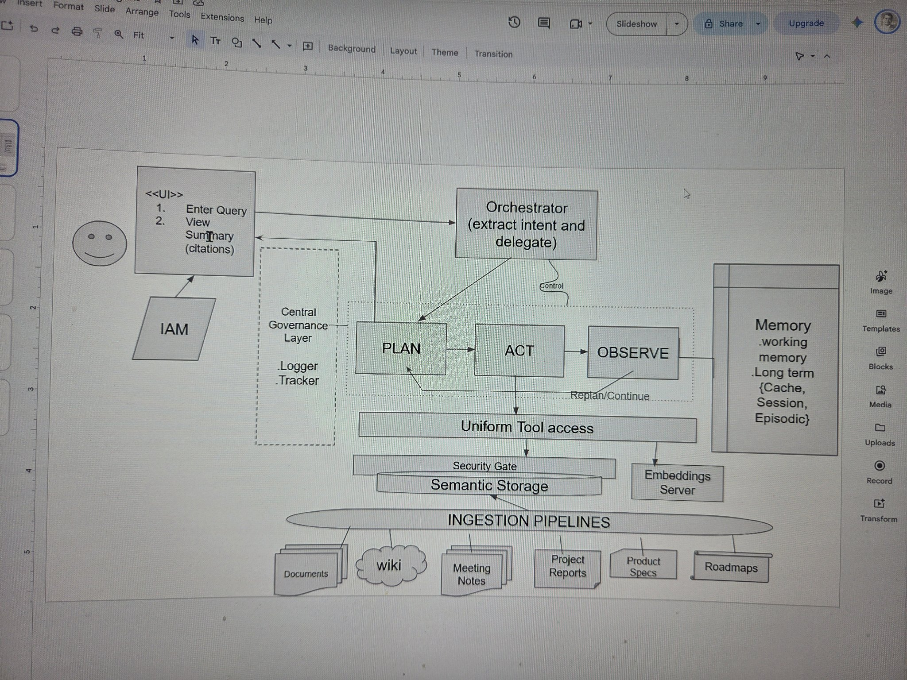

# Enterprise Knowledge Research Agent

**Interview Kickstart — Applied Agentic AI, Week 1 assignment**
*Agentic Research Systems: Planning, Tools & Guardrails*

## Assignment overview

Design an enterprise-grade research agent that can answer deep, open-ended research questions over a large corporate knowledge base — safely, accurately, and with full provenance. The design is driven by one running example query throughout:

> **"Summarize all company initiatives related to personalization and recommendation systems from the last 2 years."**

This is a hard query: it is broad, spans many documents, needs freshness ("last 2 years"), touches permission-sensitive internal content, and demands a synthesized, cited report rather than a list of links. The system below is designed to answer it — and queries like it — with a Plan → Act → Observe loop, permission-aware hybrid retrieval, grounded synthesis with cite-or-abstain, and production-grade guardrails.

## Deliverables

| # | Deliverable | File |
|---|-------------|------|
| 1 | Architecture diagram | This README (Mermaid flowchart below + original hand-drawn sketch) |
| 2 | Written system design document | [docs/01-system-design.md](docs/01-system-design.md) |
| 3 | Trade-off analysis | [docs/02-trade-offs.md](docs/02-trade-offs.md) |
| 4 | Failure mode analysis | [docs/03-failure-modes.md](docs/03-failure-modes.md) |
| 5 | Production operations discussion | [docs/04-production-operations.md](docs/04-production-operations.md) |

## Architecture

Primary architecture — recreated faithfully as a Mermaid flowchart from the hand-drawn design sketch ([original sketch](docs/architecture-sketch.jpg)):

**Component name map** — how the sketch's boxes map to the design document's components:

| Sketch component | Design doc coverage |
|---|---|
| IAM | Authentication & identity — authenticated users only see authorized information ([01-system-design.md](docs/01-system-design.md)) |
| Orchestrator (extract intent and delegate) | §3.1 Orchestrator + §3.2 Hybrid planner |
| Central Governance Layer (.Logger, .Tracker) | Observability & traceability ([04-production-operations.md](docs/04-production-operations.md)) |
| PLAN → ACT → OBSERVE loop | Plan → Act → Observe (§2, §4.1), Replan/Continue on coverage gaps |
| Uniform Tool access | §3.5 Typed tool schemas |
| Security Gate | §3.4 ACL permission filter — pre-filter at retrieval, never post-filter |
| Semantic Storage + Embeddings Server | §3.3 Retrieval pipeline — hybrid BM25 + vector index with permission-scoped cache keys |
| Memory (working + long-term {Cache, Session, Episodic}) | §3.6 Short-term vs long-term memory; session memory powers follow-up queries |
| INGESTION PIPELINES | Ingestion: parse → clean → chunk with metadata (source, author, team, timestamp, ACL) |

**How the example query flows through the system:** the employee authenticates via IAM and enters the query in the UI; the Orchestrator extracts intent and delegates to the PLAN → ACT → OBSERVE loop. Each Act step goes through Uniform Tool access and the Security Gate, retrieving only ACL-authorized documents from Semantic Storage. Observe checks whether the evidence covers the two-year window and the themes adequately, looping back to replan when gaps remain. The cited summary returns to the UI, the Central Governance Layer logs every step for traceability, and Memory retains session context so follow-up queries ("what about the mobile team?") reuse prior evidence.

## Design principles

1. **Security is structural, not a filter.** Permissions are enforced at retrieval time (Security Gate / ACL pre-filter), never as a post-processing pass.
2. **Every claim is earned.** The synthesis engine cites sources or abstains — there is no uncited text in a delivered report.
3. **Bounded autonomy.** The agent plans and acts freely *within* a termination envelope: step/depth limits, a per-query cost budget, and no-progress detection.
4. **External content is data, never instructions.** Retrieved documents are treated as untrusted data; prompt-injection defenses are built into every stage.
5. **Observable by default.** Every query produces a trace, cost accounting, and replayable spans — the system is debuggable in production, not just in demos.

---

*Author: Sai Kumar Palem — Interview Kickstart Applied Agentic AI (Mid-June cohort)*
